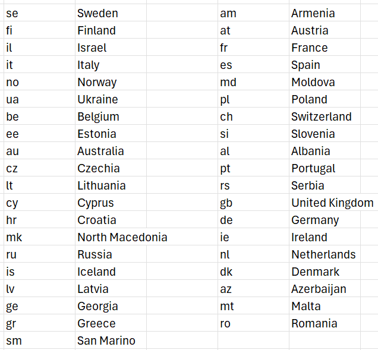
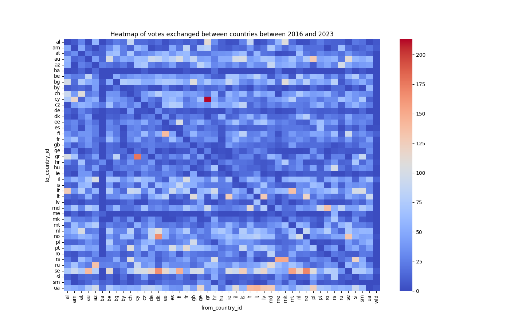
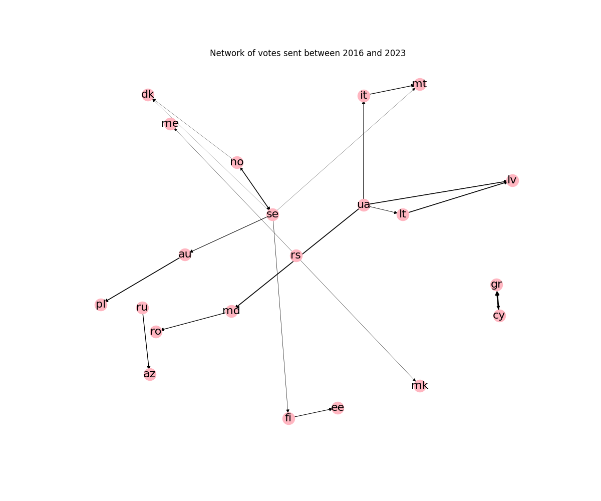
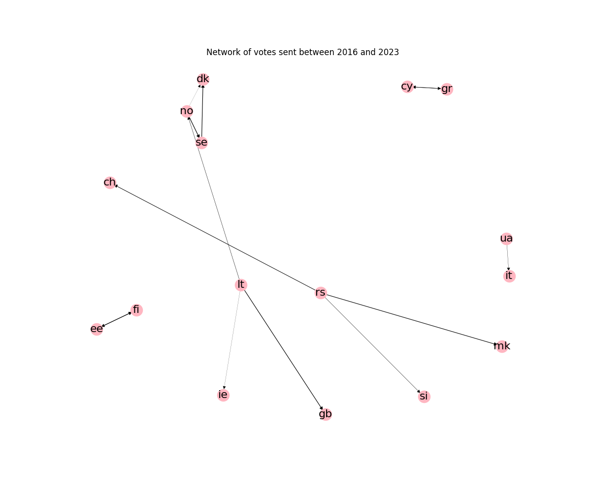

# Alliances at Eurovision

The goal of this project is to display the alliances in Eurovision. For this purpose, you can print the heatmap of the countries votes, you get also the oriented network of countries that have sent a lot of points to one another.
These graphic representations are from the year of your choice to 2023, and you can also choose if you want to see the Total points, or the Audience points, or the Jury points.

## Data

Data from : https://github.com/Spijkervet/eurovision-dataset

To help you understand the graphs you get, here is a table of codes and countries associated : 


## To run 

```pip install -r requirements.txt```

```python3 main.py [year] [type]```


```year``` is between 1956 (the beginning of Eurovision) and 2023

```type``` can be : 
- 0 : Audience points + Jury points
- 1 : Audience points only
- 2 : Jury points only

## Examples 

Here I plotted the graphs from 2016 (beginning of the new scoring system) and 2023.

The heatmap is for the total points.


This network is also for the total points.


But this network is for the Audience points.


You can see for example that North Macedonia sent a lot of points to Serbia over the years. Cyprus and Greece are also sending each other points.